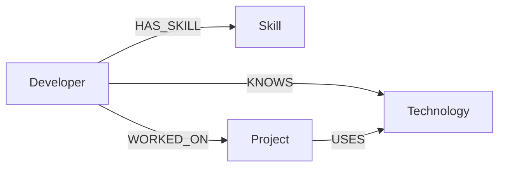

# Developer Skill & Project Network

A small full-stack application, backed by **CognoDB** (a managed graph database), that lets you
explore how developers, skills, projects and technologies connect to one another.

Built for the Wexa AI take-home assignment (CognoDB Assignment 2).

---

## 1. Project Overview

Organizations build up a web of relationships over time: developers pick up skills, work on
projects, and are exposed to technologies through those projects. Answering questions like
*"who else on the team already knows the stack this new project needs?"* means walking that
web of connections — which is exactly what a graph database is built for.

This app models that web as a graph and exposes it through a clean web UI.

## 2. Problem Statement

Engineering managers and tech leads often need to answer connection-shaped questions:

- Which developers have been exposed to technology **X**, directly or through a project?
- Who else has worked with a specific person, or on similar technologies?
- If we start a new project needing certain technologies, who are good candidates to staff it,
  based on what they already know — even if they've never touched this exact project before?

These are all questions about **paths through a network**, not about rows in a table.

## 3. Why a Graph Database?

In a relational schema, this data model would need at least four tables
(`developers`, `skills`, `projects`, `technologies`) plus junction tables for every
many-to-many relationship (`developer_skills`, `developer_projects`, `project_technologies`,
`developer_technologies`). Answering "what technologies has a developer been exposed to
through every project they've worked on" means a 3-table JOIN
(`developers → developer_projects → projects → project_technologies → technologies`), and
"which developers already know the tech a project needs but haven't worked on it" adds a
`NOT EXISTS` anti-join on top of that — verbose, easy to get wrong, and it gets worse as you
add more relationship types or hops.

In a property graph, the exact same questions are single, readable Cypher patterns:

```cypher
MATCH (d:Developer {id: $id})-[:WORKED_ON]->(:Project)-[:USES]->(t:Technology)
RETURN DISTINCT t
```

The relationships are stored as first-class citizens, so traversing them is a pattern match,
not a JOIN plan the query planner has to work out. This is the core argument this project
makes for a graph database, demonstrated by the "Connected Technologies" and
"Candidate Developers" features described below.

## 4. Why CognoDB?

CognoDB is a managed graph database that speaks openCypher over the Bolt protocol and works
with the official Neo4j drivers, so the backend uses the standard, well-documented
`neo4j-java-driver` rather than a custom SDK. The free tier is enough to demonstrate a small,
realistic dataset (a few thousand nodes/relationships), and provisioning a new instance takes
under a minute — well suited to a fast-moving take-home project.

## 5. Technologies Used

**Backend**
- Java 17, Spring Boot 3, Maven
- Official Neo4j Java Driver (talks to CognoDB over Bolt)
- Plain Spring MVC REST controllers — no Spring Data JPA / MySQL for the graph data

**Frontend**
- React 18 + Vite
- React Router
- Axios
- Plain CSS (no UI framework, to keep the project simple and dependency-light)

## 6. Architecture

```
graphapp/
├── backend/                       Spring Boot REST API
│   └── src/main/java/com/wexa/graphapp/
│       ├── config/                Neo4j driver bean, CORS config, startup seeding
│       ├── controller/            REST endpoints
│       ├── service/                Business logic, one service per entity
│       ├── repository/            All Cypher queries (parameterized)
│       ├── model/                  Plain node models (Developer, Skill, Project, Technology)
│       ├── dto/                    Response shapes combining multiple entities
│       └── exception/             Global error handling
└── frontend/                       React + Vite SPA
    └── src/
        ├── api/                    Axios client
        ├── pages/                  Dashboard, Developers, Projects, Graph Explorer, details
        ├── components/            Reusable UI pieces (loading/empty/error states, etc.)
        └── styles/                 Global CSS
```

Request flow: **React UI → Axios → Spring REST controller → Service → GraphRepository →
Neo4j Java Driver → CognoDB (Bolt) → Cypher query → mapped back into DTOs → JSON → UI.**

## 7. Graph Data Model

**Nodes:** `Developer`, `Skill`, `Project`, `Technology`

**Relationships:**
- `(Developer)-[:HAS_SKILL]->(Skill)`
- `(Developer)-[:WORKED_ON]->(Project)`
- `(Project)-[:USES]->(Technology)`
- `(Developer)-[:KNOWS]->(Technology)`

### 8. Graph Diagram (Mermaid)



## 9. Node Descriptions

| Node | Properties | Description |
|---|---|---|
| `Developer` | `id`, `name`, `email` | A person on the team |
| `Skill` | `id`, `name` | A general competency (e.g. "Backend Development") |
| `Project` | `id`, `name`, `description` | A piece of work a developer contributed to |
| `Technology` | `id`, `name`, `category` | A specific tool/language/framework (e.g. "React") |

## 10. Relationship Descriptions

| Relationship | Meaning |
|---|---|
| `HAS_SKILL` | The developer has this general skill |
| `WORKED_ON` | The developer contributed to this project |
| `USES` | The project uses this technology |
| `KNOWS` | The developer has direct, hands-on knowledge of this technology |

## 11. API Endpoints

| Method | Path | Description |
|---|---|---|
| GET | `/api/dashboard` | Node counts for the dashboard |
| GET | `/api/health` | Whether CognoDB is reachable |
| GET | `/api/developers?search=` | List / search developers by name |
| GET | `/api/developers/{id}` | Developer + skills + projects + connected/known technologies |
| GET | `/api/developers/{id}/skills` | Skills for one developer |
| GET | `/api/developers/{id}/projects` | Projects for one developer |
| GET | `/api/developers/{id}/connected-technologies` | 2-hop traversal (see below) |
| GET | `/api/developers/{id}/related-developers` | Other developers sharing a project or technology |
| GET | `/api/projects` | List all projects |
| GET | `/api/projects/{id}` | Project + technologies + developers |
| GET | `/api/projects/{id}/technology-network` | Same as above, named for the UI feature |
| GET | `/api/projects/{id}/candidate-developers` | 3-hop anti-join traversal (see below) |
| GET | `/api/projects/{id}/qualified-developers` | Developers who know the project's technologies |
| GET | `/api/skills` | List all skills |
| GET | `/api/technologies` | List all technologies |
| POST | `/api/seed` | Re-run the idempotent demo seed script |

## 12. Important Cypher Queries

**Skills of a developer (1 hop):**
```cypher
MATCH (d:Developer {id: $id})-[:HAS_SKILL]->(s:Skill)
RETURN s ORDER BY s.name
```

**Connected Technologies — multi-hop traversal (2 hops):**
```cypher
MATCH (d:Developer {id: $id})-[:WORKED_ON]->(:Project)-[:USES]->(t:Technology)
RETURN DISTINCT t ORDER BY t.name
```

**Candidate developers for a project — 3-hop, relational-unfriendly query:**
```cypher
MATCH (p:Project {id: $id})-[:USES]->(t:Technology)<-[:KNOWS]-(d:Developer)
WHERE NOT (d)-[:WORKED_ON]->(p)
RETURN DISTINCT d ORDER BY d.name
```

**Related developers via shared project or technology (multi-path):**
```cypher
MATCH (d:Developer {id: $id})-[:WORKED_ON]->(p:Project)<-[:WORKED_ON]-(other:Developer)
WHERE other.id <> $id
RETURN DISTINCT other.id AS id, other.name AS name, p.name AS viaProject, 'Project' AS via
UNION
MATCH (d:Developer {id: $id})-[:KNOWS]->(t:Technology)<-[:KNOWS]-(other:Developer)
WHERE other.id <> $id
RETURN DISTINCT other.id AS id, other.name AS name, t.name AS viaProject, 'Technology' AS via
```

All of the above are executed through the official Neo4j Java Driver with parameters passed
as a `Map<String, Object>` — never through string concatenation.

## 13. Explanation of the Multi-Hop Traversal

`findConnectedTechnologiesOfDeveloper` walks:

```
Developer --WORKED_ON--> Project --USES--> Technology
```

Starting at one developer, it follows every `WORKED_ON` edge to reach the projects they've
contributed to, then follows every `USES` edge from those projects to reach technologies —
two hops in total. `DISTINCT` collapses technologies reached via more than one project so each
technology appears once. This answers "what has this developer been exposed to, even
indirectly" — useful for staffing and skills-gap conversations that direct `KNOWS` edges alone
can't answer.

## 14. Why This Traversal Is Useful (vs. Relational)

The equivalent SQL is a three-table join with a `DISTINCT`:

```sql
SELECT DISTINCT t.*
FROM developer_projects dp
JOIN project_technologies pt ON dp.project_id = pt.project_id
JOIN technologies t ON pt.technology_id = t.id
WHERE dp.developer_id = ?;
```

That's manageable at 2 hops, but the "candidate developers" query adds a `NOT EXISTS`
anti-join across a fourth table, and each additional hop (e.g. "technologies known by
teammates of teammates") adds another JOIN and gets harder to write and to optimize. In
Cypher, adding a hop means adding one more `-[:REL]->()` to the pattern — the query stays
readable regardless of how deep the traversal goes.

## 15. Local Setup Instructions

### Prerequisites
- Java 17+ and Maven
- Node.js 18+ and npm
- A CognoDB Cloud instance (see step-by-step below)

### 15.1 Create your CognoDB instance
1. Go to `https://console.cognodb.com/signup` and sign up (free tier, no credit card).
2. From the console, create a free (**c0**) instance and pick a region.
3. Copy the connection URI (`bolt+s://<instance-id>.databases.cognodb.cloud`) and the
   generated password for user `cognodb` — **the password is shown only once**.

### 15.2 Environment Variables

**Backend** (`backend/.env.example` → copy to real environment variables):
```
COGNODB_URI=bolt+s://<your-instance-id>.databases.cognodb.cloud
COGNODB_USERNAME=cognodb
COGNODB_PASSWORD=<your-generated-password>
ALLOWED_ORIGINS=http://localhost:5173
PORT=8080
AUTO_SEED=true
```

**Frontend** (`frontend/.env.example` → copy to `.env`):
```
VITE_API_URL=http://localhost:8080/api
```

> Never commit real `.env` files or passwords. Both are already listed in `.gitignore`.

### 15.3 Run the Backend
```bash
cd backend
export COGNODB_URI="bolt+s://<your-instance-id>.databases.cognodb.cloud"
export COGNODB_USERNAME="cognodb"
export COGNODB_PASSWORD="<your-generated-password>"
export ALLOWED_ORIGINS="http://localhost:5173"
mvn spring-boot:run
```
The backend starts on `http://localhost:8080`. Because `AUTO_SEED=true` by default, it will
automatically load the demo dataset into CognoDB on first run if the graph is empty.

### 15.4 Run the Frontend
```bash
cd frontend
npm install
cp .env.example .env    # adjust VITE_API_URL if needed
npm run dev
```
The frontend starts on `http://localhost:5173`.

### 15.5 Seed Data Manually (optional)
Seeding happens automatically on startup, but you can re-trigger it any time
(it's idempotent — safe to run repeatedly):
```bash
curl -X POST http://localhost:8080/api/seed
```

## 16. Testing the API

```bash
curl http://localhost:8080/api/health
curl http://localhost:8080/api/dashboard
curl http://localhost:8080/api/developers
curl http://localhost:8080/api/developers/dev-1
curl http://localhost:8080/api/developers/dev-1/connected-technologies
curl http://localhost:8080/api/projects
curl http://localhost:8080/api/projects/proj-1
curl http://localhost:8080/api/projects/proj-1/candidate-developers
```

Sample response for `GET /api/developers/dev-1`:
```json
{
  "developer": { "id": "dev-1", "name": "Aisha Khan", "email": "aisha.khan@example.com" },
  "skills": [{ "id": "skill-1", "name": "Backend Development" }],
  "projects": [{ "id": "proj-1", "name": "Talent Graph Explorer", "description": "..." }],
  "connectedTechnologies": [{ "id": "tech-1", "name": "Java", "category": "Language" }],
  "knownTechnologies": [{ "id": "tech-1", "name": "Java", "category": "Language" }]
}
```

Basic backend unit tests live in `backend/src/test/java/.../DeveloperServiceTest.java` and can
be run with:
```bash
cd backend
mvn test
```

## 17. Deployment

### Backend (Render / Railway / any Java host)
1. Push this repo to GitHub.
2. Create a new **Web Service** from the repo, root directory `backend`.
3. Build command: `mvn clean package -DskipTests`
   Start command: `java -jar target/graphapp-1.0.0.jar`
4. Set environment variables in the platform's dashboard:
   `COGNODB_URI`, `COGNODB_USERNAME`, `COGNODB_PASSWORD`, `ALLOWED_ORIGINS`
   (set this to your deployed frontend URL), `AUTO_SEED=true`. The platform sets `PORT`
   automatically — the app already reads it via `${PORT:8080}`.

### Frontend (Vercel / Netlify)
1. Create a new project from the repo, root directory `frontend`.
2. Build command: `npm run build` — Output directory: `dist`
3. Set environment variable `VITE_API_URL` to your deployed backend's `/api` URL
   (e.g. `https://your-backend.onrender.com/api`).

### Verifying the deployed app
- Visit `https://<your-backend>/api/health` — should return `{"status":"UP", ...}`.
- Visit the deployed frontend URL — the Dashboard should show non-zero counts.
- Open the browser dev tools Network tab and confirm API calls go to your deployed backend,
  not `localhost`.

## 18. Screenshots

_Add screenshots of the Dashboard, Developers list, Developer Details, Projects, Project
Details, and Graph Explorer pages here before submitting._

## 19. Future Improvements

- Add authentication so different teams can manage their own data.
- Add write operations (create/edit developers, projects, skills) through the UI.
- Add a true force-directed graph visualization (e.g. via a lightweight canvas/SVG library)
  as an alternative to the column-based Graph Explorer view.
- Add pagination for large datasets.
- Add integration tests that run against a disposable Neo4j/CognoDB test instance.

---

## GitHub Submission Checklist

- [ ] Code pushed to a GitHub repository (public, or private with Wexa given access)
- [ ] `.env` files are **not** committed (check `git status` / `.gitignore`)
- [ ] `README.md` includes the "Why a graph database?" section (this file, section 3)
- [ ] Data model diagram included (section 8, Mermaid)
- [ ] Seed script included and documented (`SeedDataService` + section 15.5)
- [ ] At least one 2+ hop traversal implemented and explained (sections 12–14)
- [ ] At least one query that's awkward in SQL implemented and explained (candidate developers)
- [ ] All queries parameterized (verified in `GraphRepository.java`)
- [ ] Working web app with loading, empty and error states
- [ ] CognoDB instance left running until Wexa reviews the submission
- [ ] Hosted demo link added to this README and to the submission email
- [ ] Short screen recording created
- [ ] Email sent to `hr@wexa.ai` with subject `CognoDB Assignment 2 – <Your Name>`

## Demo / Screen Recording Script (2–3 minutes)

1. **(15s)** "This is a Developer Skill & Project Network app backed by CognoDB, a managed
   graph database." Show the Dashboard with live counts.
2. **(30s)** Open **Developers**, click into one developer. Point out Skills, Known
   Technologies, and Projects — all direct, 1-hop relationships.
3. **(30s)** Scroll to **Connected Technologies** — explain this is a 2-hop traversal
   (Developer → Project → Technology) showing technologies reached indirectly.
4. **(30s)** Open **Projects**, click into a project. Point out **Candidate Developers** —
   explain this is the query that would be awkward in SQL (3-hop + anti-join).
5. **(30s)** Open **Graph Explorer**, switch between a couple of developers to show the
   connections update live.
6. **(15s)** Close with: "All queries are parameterized through the official Neo4j driver,
   and connection details come from environment variables — never committed to source."

## Likely Interview Questions & Simple Answers

**Q: Why not just use a relational database with JOINs?**
A: You can, and for 1–2 hops it's fine. But every extra hop of "and then what's connected to
that" adds another JOIN, and "connected but not yet linked" patterns need anti-joins. In
Cypher, adding a hop is just adding another `-[:REL]->()` — same readability at any depth.

**Q: How do you prevent Cypher injection?**
A: Every query uses the driver's parameter maps (`session.run(query, params)`) — user input is
never concatenated into the query string. See `GraphRepository.java`.

**Q: What happens if CognoDB is down?**
A: The driver throws a `Neo4jException`, which `GraphRepository` catches and rewraps as a
`DatabaseUnavailableException`. The global exception handler turns that into a clean HTTP 503
with a friendly message instead of a stack trace, and the frontend shows an error state with
a retry button.

**Q: Why didn't you use Spring Data Neo4j?**
A: The assignment asks for the official Neo4j driver directly, which also makes the exact
Cypher being run fully explicit and easy to walk through in an interview, rather than
generated by an object-graph mapper.

**Q: How is the seed data idempotent?**
A: Every seed query uses `MERGE` (not `CREATE`) keyed on each entity's `id`, so re-running the
seed script updates existing nodes/relationships instead of duplicating them.

**Q: How would you scale this beyond the free tier?**
A: Add indexes/constraints for frequently filtered properties (already done for `id` via
uniqueness constraints), paginate list endpoints, and consider read replicas for read-heavy
traffic once the dataset and query volume grow past a single small instance.
